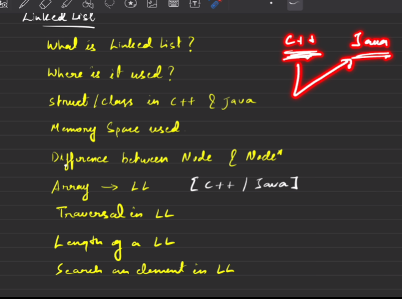
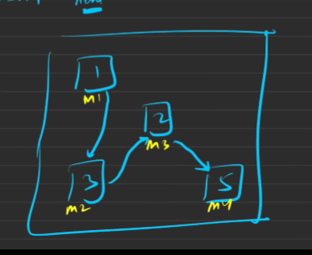

# DAY 1

# 1. What is LinkedList 
➡️ Linked-list linear data-structure that stores element non-contiguous memory location. Its size increase at any moments. 

* In Linked List we store data and next pointer,  we traverse linked-list using the next pointer. 
* > Next stores memory location of next element.(Node)
* First node in the linked-list is known as head and last node also known as tail. tail point to the null.



---------------

> In 32 bit int size is 4byte and pointer 4 byte and 64 bit machine int still  same but pointer size got increased. size 8 byte.
> 

----------------
# Questions needs  to revision.

## Reverse a LinkedList using recursion. 💫 [Link](https://leetcode.com/problems/reverse-linked-list/)

* Main thought is a single LinkedList is already in reverse order. 5 -> null;
* Reversing should be happened if there is 2 Node exist. 5-> 2 -> null || 2 -> 5 -> null
* My Last Node is my Reverse order first Node.
* head.next.next = head means 5 -> 2 , 5 is parent of 2 Node 5 Next 2 and 2 ki next must parent.
* In old age we have nothing in our back,5 -> NUll 2 -> 5
```Java
 public static ListNode reverse (ListNode head) {
        if (head == null || head.next ==   null) {
            return head;
        }
        
        ListNode MyLastIsMyHead = reverse(head);
        head.next.next = head;
        head.next = null; // we not reverse our linked-list at for a single node. GO README.MD
        return MyLastIsMyHead;
    }
```
--------------
