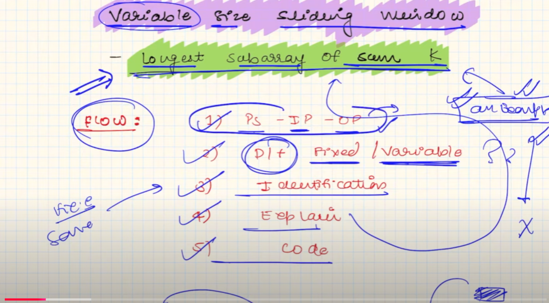

## Problem statement
1. longest subArray with sum k
2. dynamically increase and decrease 

### difference between fixed and variables size
1. fixed pattern -> window size given and do something like maximum or find. need to calculate condition.
2. variable -> window size not given need calculate, maximum or minimum window size. condition given.

-----------

## How move window in variable.
fixed size window, When window size should hit, we just removed the last one of the window  and put new one in the window.

Variable sized window, we start window size from  0 and go further util, a certain condition not hit. Formula of calculating window `i - j + 1`

# identification
1. arr / string
2. sub / sub
3. k -> sum / condition -> fixed 
4. window size will be change

--------

# Problems are started !
## 3. Longest Substring Without Repeating Characters
#### Brute force
1. Generate all the substring and check is changes possible o r not.
Disclaimer 👽:
   1. don't touch max frequency because it is easy to change small people rather than a lot of  people.
### Optimized using variable window.
1. Every time we need to check minimum  changes,  If the minimum change is greater of minimumKth change. we need to reduce the window to  validate the certain condition.